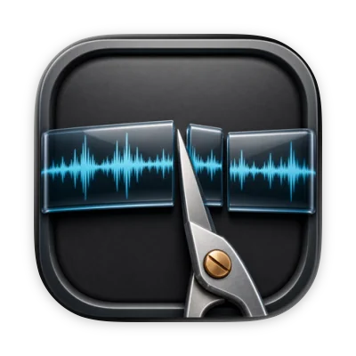
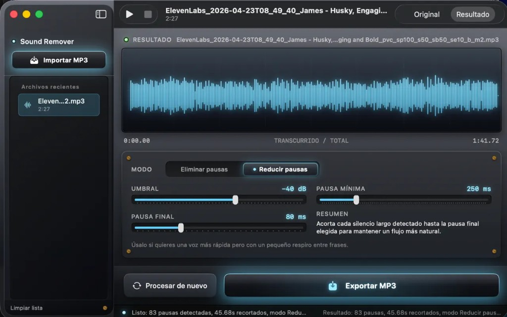

[← Back to CV](../../)

# Audio Silence Remover

Audio Silence Remover is a free Mac app and an open-source project. The App Store build and the GitHub repository use the same codebase.

I built it because dead air was slowing down every TikTok and YouTube voiceover I edited. The browser demos I found uploaded the file and ran a model. Silence detection only needs a volume threshold, so that route added work without improving the cut.

The app reads the waveform, finds segments below a chosen decibel threshold, and removes or shortens them. Processing stays on the Mac. The app has no account, cloud service, or analytics pipeline.

## Workflow

- Import a spoken-word MP3.
- Set the silence threshold and the minimum pause length.
- Remove each pause or reduce it to a target duration.
- Compare the original and edited waveforms.
- Export a new MP3.

My usual path is an ElevenLabs or recorded voiceover, one pass through the app, then the cleaned file goes into the video edit.

## How it was built

The macOS app uses Swift and SwiftUI. The audio path reads samples, finds runs below the threshold, and splices the segments that remain. There is no machine-learning step.

I chose a skeuomorphic interface on purpose. Brushed metal, glass panels, knobs, and switches fit a single-purpose audio utility better than another flat settings window.

The App Store release required sandbox signing, a macOS 15 or later target, English and Spanish strings, privacy labels, and review cycles. The privacy label states that the developer collects no data.

## Links

- [Audio Silence Remover on the Mac App Store](https://apps.apple.com/us/app/audio-silence-remover/id6763403196?mt=12)
- [Source on GitHub](https://github.com/felipebasurto/silence-remover)

## Screenshot

The main window shows recent files, the waveform comparison, pause controls, the threshold, and export.

