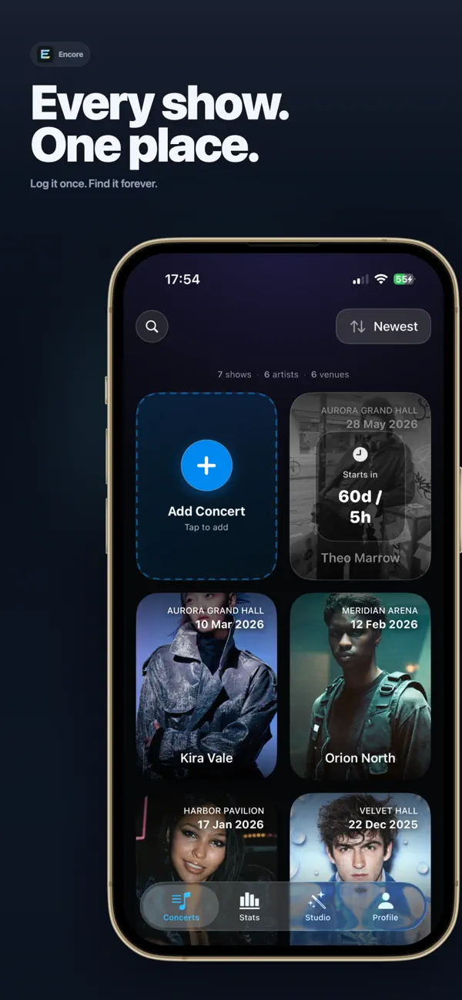
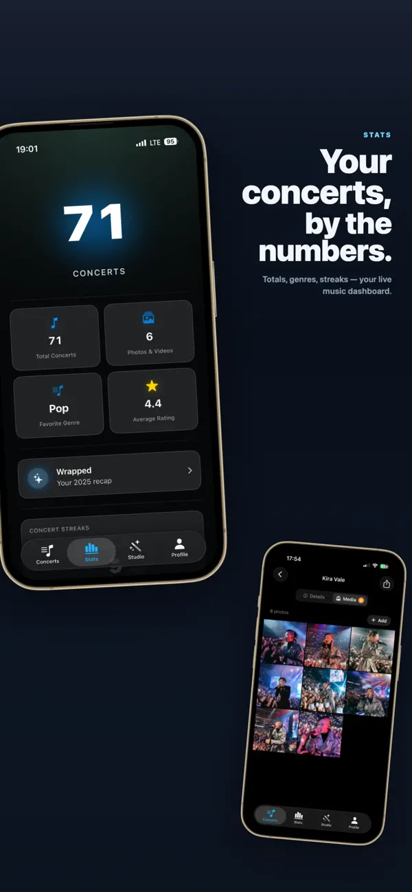
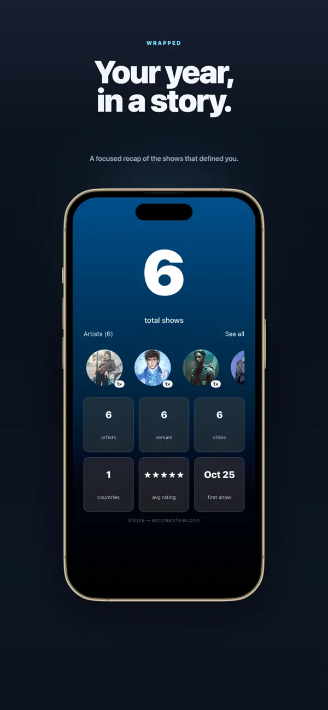
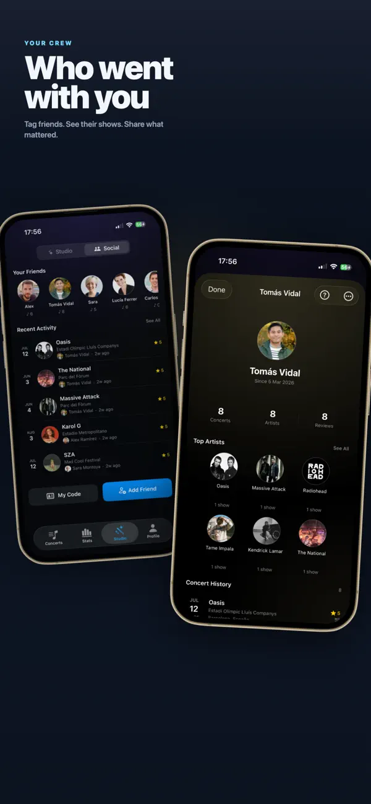
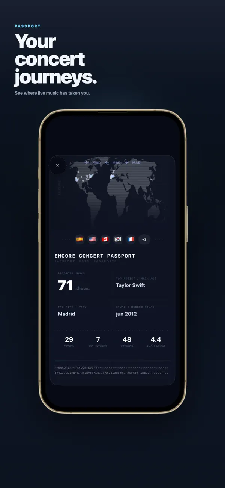
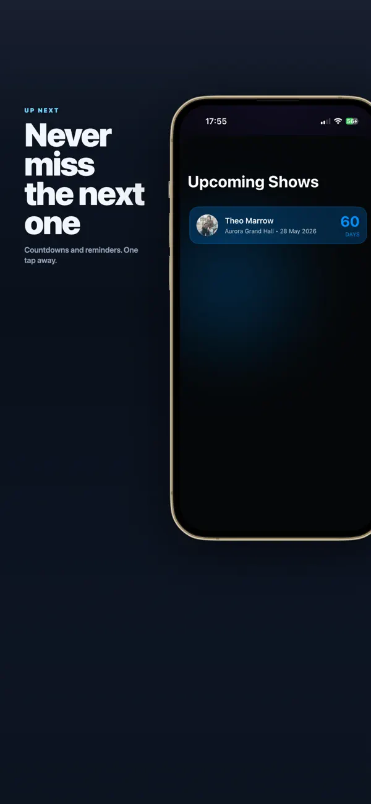

[← Back to CV](../../)

# Encore: Concert Diary

**Context:** A **hobby / side project**—not my profession. I built it to **ship a real app** in my own time and **experiment** (including **AI-assisted** build and product loops).

**Encore** is an **iPhone concert diary**: log shows with **photo & video**, track **stats** over time, add **friends**, see **upcoming** dates, keep a **passport**-style history of venues and tours, and get a **year-end wrapped** built around the gigs you actually went to.

## What I shipped (product + iOS)

As a **side** project I built it **end-to-end in Swift / SwiftUI**: product shape, navigation, persistence, polish, **App Store** cadence (metadata, review cycles, crash triage), and iteration from **user feedback**. Feature-wise that means a **feed** you want to scroll, **stats** that reward consistency, lightweight **social** features (follows / friends without building a full feed product), and flows that stay usable in loud venues and late nights after a show.

Revenue is past **$2k** from paying users. Post-launch work: tightening onboarding, fixing edge cases, and shipping again when usage shows something is confusing.

## Sustained iteration

**release → listen → fix → ship** on a loop—same cadence as a product team, except I also handle support DMs, analytics, and crash triage.

## Distribution (no paid acquisition)

There’s no paid acquisition budget, so growth is **organic short-form content** on the platforms where concert culture already lives—**TikTok**, **Instagram**, **YouTube**, and **Facebook**—with a **network of accounts** so Encore shows up in the **same feeds** people use for tickets, openers, and crowd videos. It’s deliberate and repetitive work; it’s how the app gets reach without ad spend.

## Links

- **Product (EN):** [encorearchives.com](https://encorearchives.com)
- **Product (ES):** [encorearchives.com/es](https://encorearchives.com/es)
- **App Store (US):** [Encore: Concert Diary](https://apps.apple.com/us/app/encore-concert-diary/id6748657647)
- **Summary on the home page:** [CV / home](../../)

## App Store gallery

Screens from the live App Store listing: feed, stats, wrapped, friends, passport, and upcoming shows.

