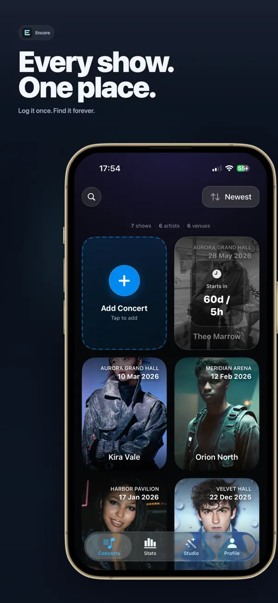
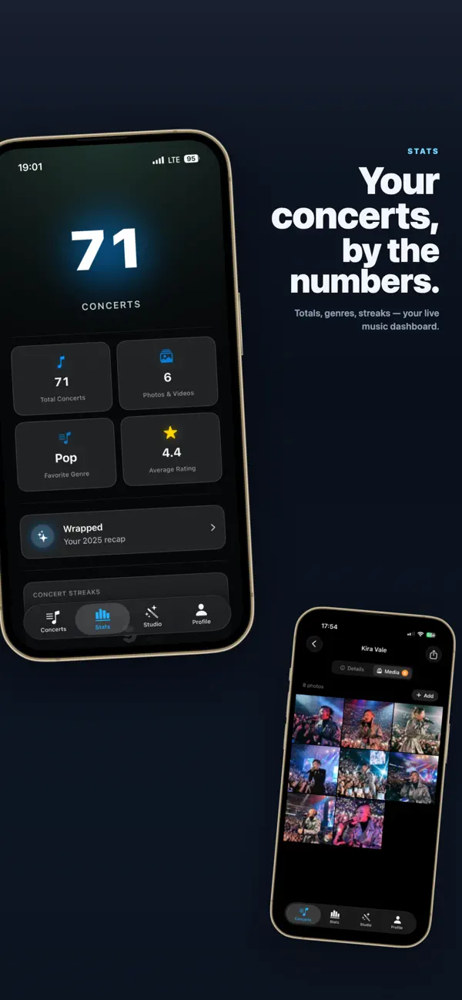
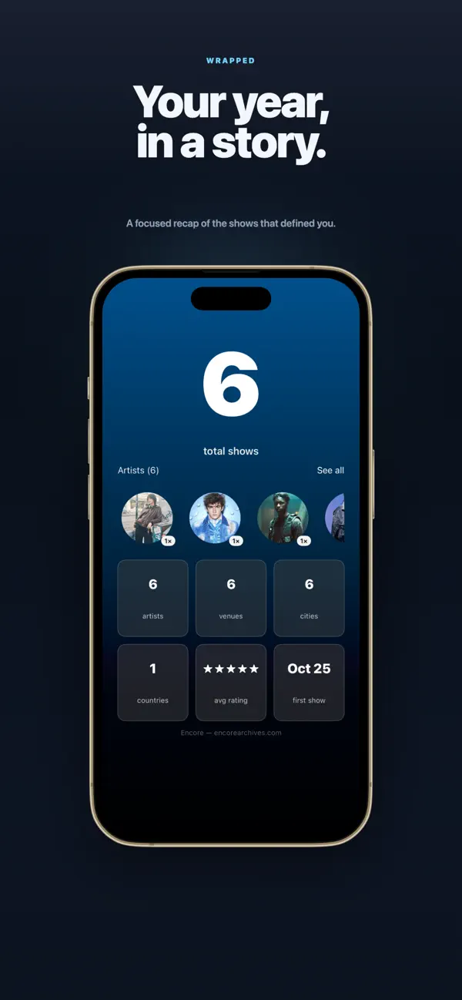
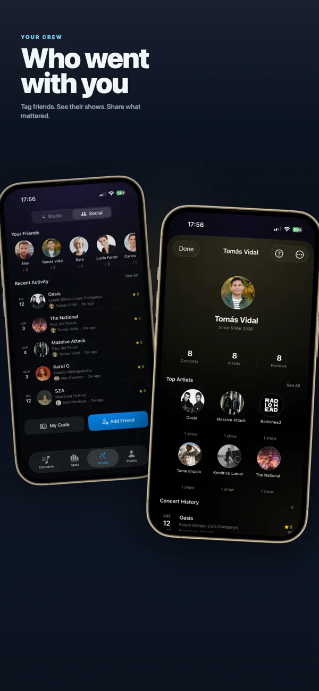
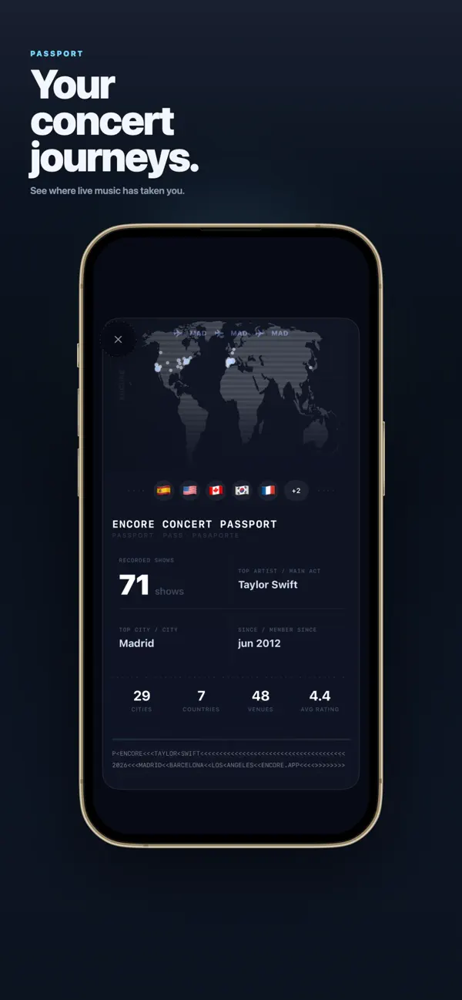

[← Back to CV](../../)

# Encore: Concert Diary

Encore is an independent iPhone app that I have built and run since May 2025. I use Cursor as the editor.

The useful moment is the ride home after a show. You can log the artist, venue, date, photos, and videos while the details are still fresh. Encore turns those entries into a concert history instead of another camera roll folder.

## The product

- A feed for past concerts and the people who went with you.
- Personal stats, venue history, and a passport for places you have seen music.
- Upcoming dates and a year-end recap built from your entries.
- Friends, shared memories, photos, and video attached to each show.

## Building and running it

The app is written in Swift and SwiftUI. I own navigation, persistence, analytics, crash triage, App Store reviews, and each release.

Revenue from paying users has passed $2,000. That number is modest, but it changed how I work. A crash report or a confusing first screen now has a customer on the other side, not a hypothetical user.

## Distribution

I have not used an ad budget. Installs come from short videos on TikTok, Instagram, YouTube, and Facebook. The posts that work show the app inside a real concert memory, not a feature tour.

## Links

- [Product site in English](https://encorearchives.com)
- [Product site in Spanish](https://encorearchives.com/es)
- [Encore on the App Store](https://apps.apple.com/us/app/encore-concert-diary/id6748657647)

## App Store gallery

Screens from the live listing show the feed, stats, year-end recap, friends, passport, and upcoming shows.

