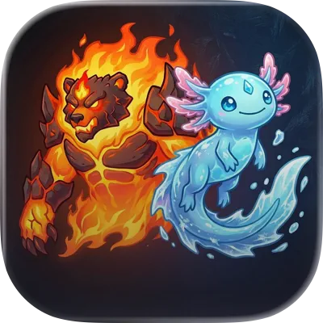
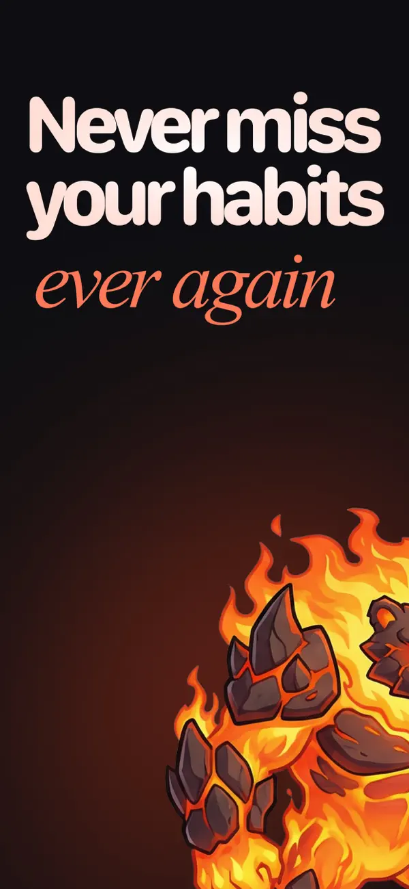
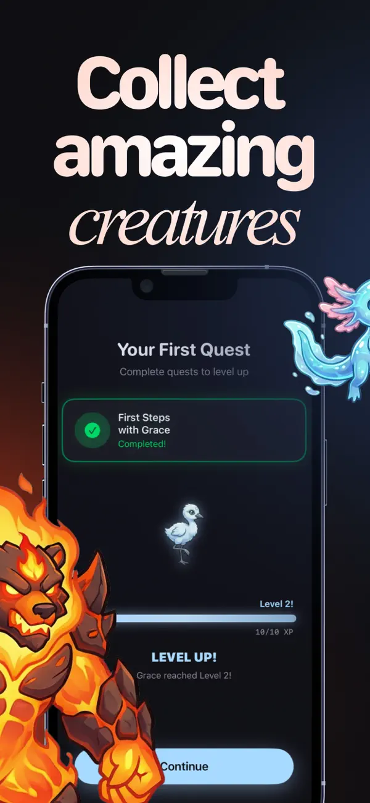
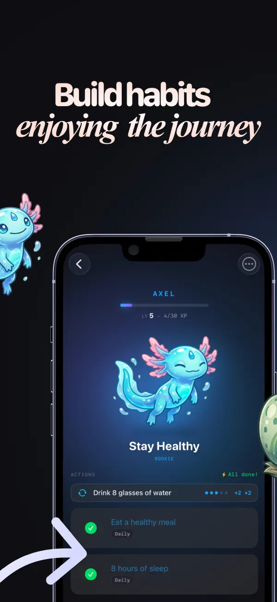
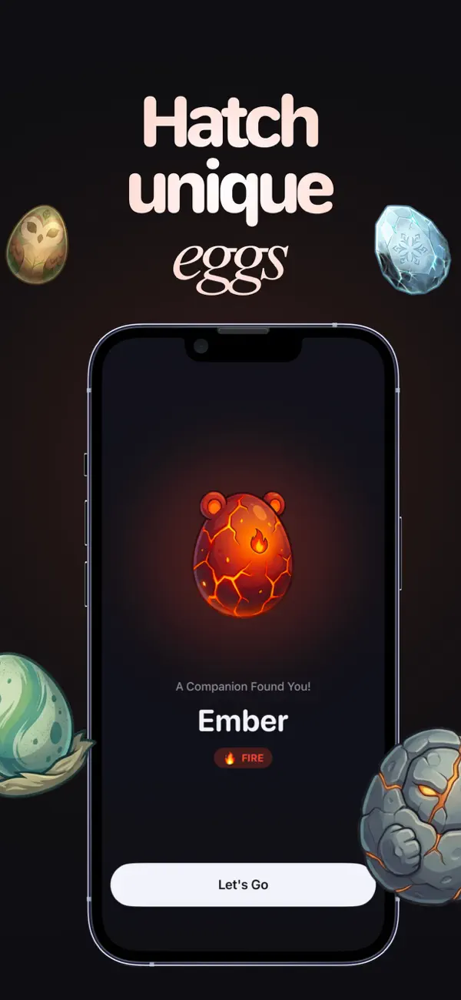
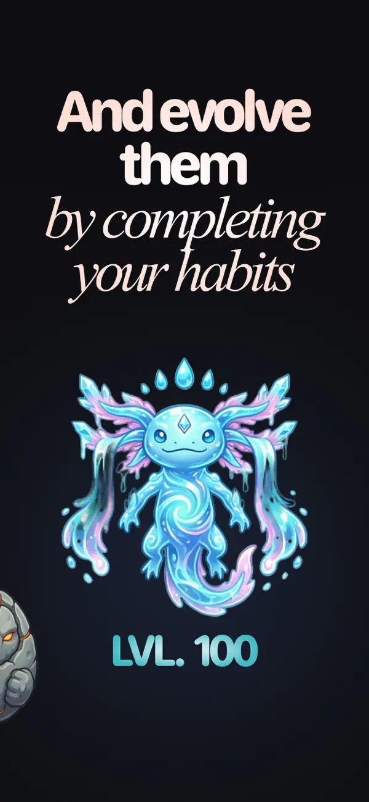
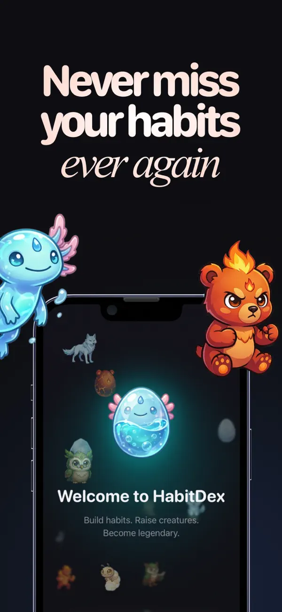

[← Back to CV](../../)

# HabitDex

> Habits that feel like a game — not another guilt checklist.

**Context:** A **hobby** build in my free time — a place to **play with product** and **AI tooling** alongside a friend; not my profession.

**HabitDex** is an iPhone habit tracker built around a light **creature-collection** loop: you log days, earn **XP**, protect **streaks**, and **unlock / evolve** companions so consistency feels tangible. Your history lives **on the device** first; **iCloud** via **CloudKit** is optional when you want the same data across devices.

We built it together with **Miguel Ferrer** ([LinkedIn](https://www.linkedin.com/in/mffdr/?locale=en)) — he owned **product design**, **UI**, **UX**, and **branding** end to end; I focused on **iOS engineering**, data, and shipping to the **App Store**.

## Links

- **Miguel Ferrer (design):** [LinkedIn](https://www.linkedin.com/in/mffdr/?locale=en)
- **App Store:** [HabitDex](https://apps.apple.com/us/app/habitdex/id6755887620) (iPhone)
- **Product site:** [v0-habitdex.vercel.app](https://v0-habitdex.vercel.app/)
- **Policies:** [Privacy](https://v0-habitdex.vercel.app/privacy) · [Terms](https://v0-habitdex.vercel.app/tos)

## What’s in the app

- **Daily habits & streaks** — Fast logging and streak feedback that rewards showing up, not perfect weeks.
- **Creatures & progression** — Collect and evolve companions as you stay consistent; the fantasy supports the habit, not the other way around.
- **Stats you can read at a glance** — Progress and patterns stay visible so **today’s progress is obvious** without digging.
- **Privacy-first by default** — Core data stays local; cloud sync is opt-in.
- **HabitDex PRO** — Optional in-app purchases / subscription for deeper features, wired through **Apple** and **RevenueCat**; the free tier stays a real product, not a demo wall.

## How it was built

I built it as an **end-to-end iOS product** in **SwiftUI**: flows wired to his design, persistence aligned with **Apple’s on-device model** and **CloudKit** when sync is enabled — so there is no unrelated server holding your habits by default. Monetization uses **StoreKit** with **RevenueCat** so entitlements, experiments, and paywalls do not turn into bespoke plumbing.

Shipping meant real **App Store** work — metadata, privacy nutrition labels, review feedback, device testing — then **iteration from usage**: tightening first-run clarity, balancing the reward loop so creatures stay motivating without obscuring the actual habit, and keeping performance snappy on older phones.

Free to download; **HabitDex PRO** funds continued development.

## App Store gallery

Screens below are from the live listing: home and today’s habits → collection → habit detail → stats → settings → PRO.

