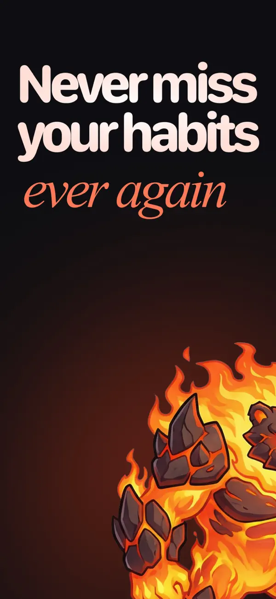
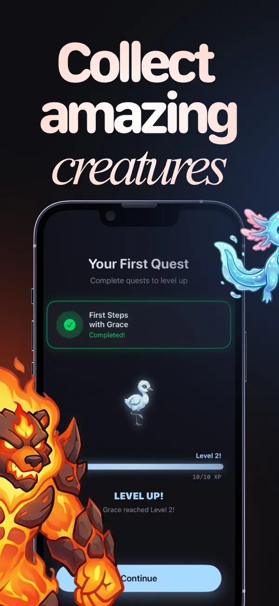
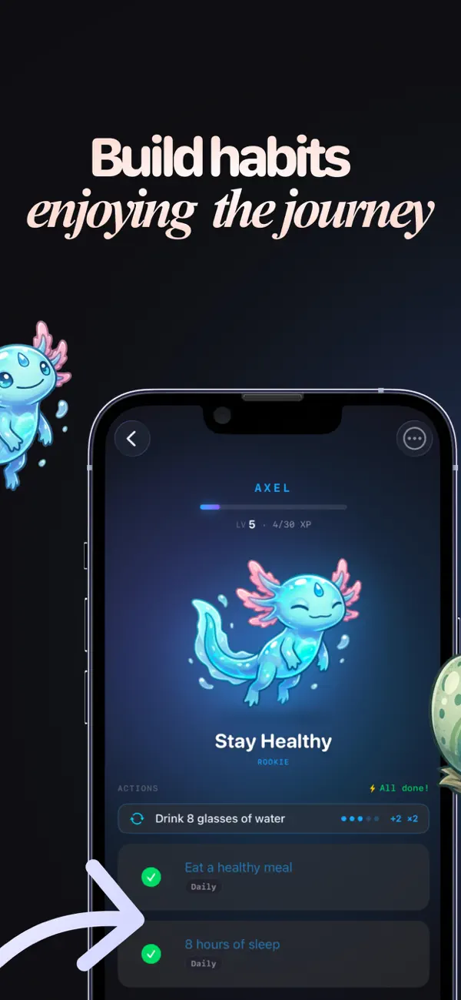
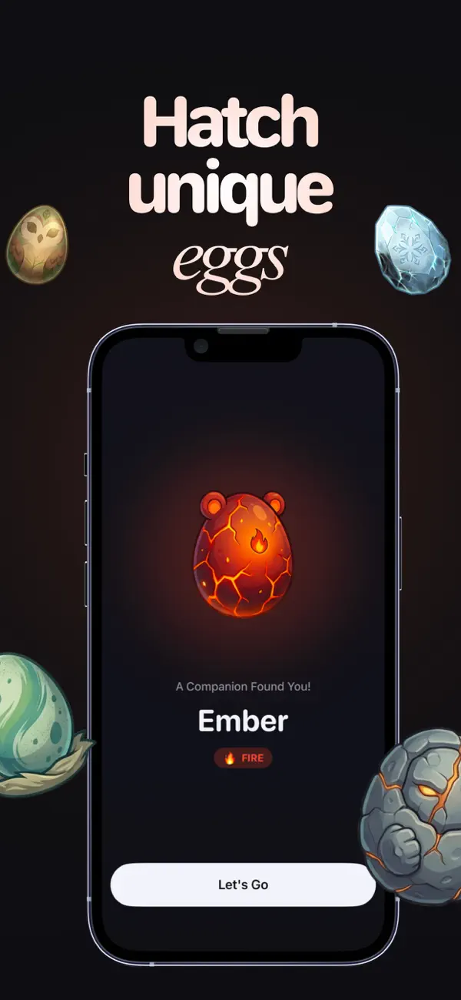
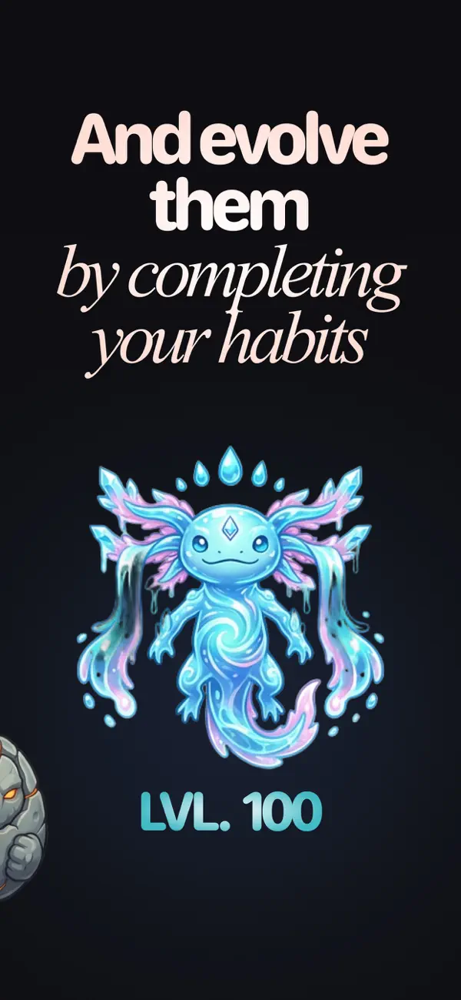
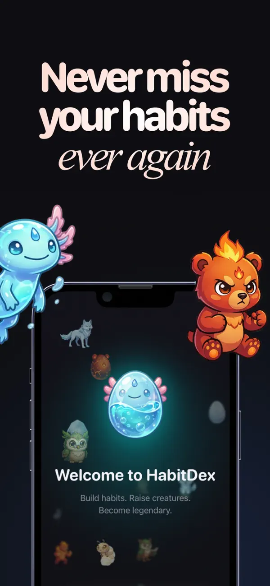

[← Back to CV](../../)

# HabitDex

> Habits that feel like a game — not another guilt checklist.

**Miguel Ferrer** ([LinkedIn](https://www.linkedin.com/in/mffdr/?locale=en)) did design; I did iOS.

**HabitDex** is a Pokémon-style habit tracker: log days, earn **XP**, protect **streaks**, unlock and evolve companions. Data stays **on the device**; **iCloud** via **CloudKit** is optional for sync across devices.

## Links

- **Miguel Ferrer (design):** [LinkedIn](https://www.linkedin.com/in/mffdr/?locale=en)
- **App Store:** [HabitDex](https://apps.apple.com/us/app/habitdex/id6755887620) (iPhone)
- **Product site:** [v0-habitdex.vercel.app](https://v0-habitdex.vercel.app/)
- **Policies:** [Privacy](https://v0-habitdex.vercel.app/privacy) · [Terms](https://v0-habitdex.vercel.app/tos)

## What’s in the app

- **Daily habits & streaks** — Quick logging; streak feedback rewards showing up, not perfect weeks.
- **Creatures & progression** — Collect and evolve companions as you stay consistent.
- **Stats on the home screen** — Progress visible without digging into settings.
- **Local by default** — Core data on the phone; iCloud sync is opt-in.
- **HabitDex PRO** — Optional subscription via **StoreKit** and **RevenueCat**; the free tier is usable without paying.

## How it was built

**SwiftUI** app wired to Miguel's design. Persistence uses Apple's on-device model and **CloudKit** when sync is on—no separate server holding your habits. **StoreKit** + **RevenueCat** for subscriptions and paywalls.

App Store work: metadata, privacy labels, review feedback, device testing. Then iteration from usage—first-run clarity, reward loop balance, performance on older phones.

Free to download; **HabitDex PRO** funds continued development.

## App Store gallery

Screens below are from the live listing: home and today’s habits → collection → habit detail → stats → settings → PRO.

