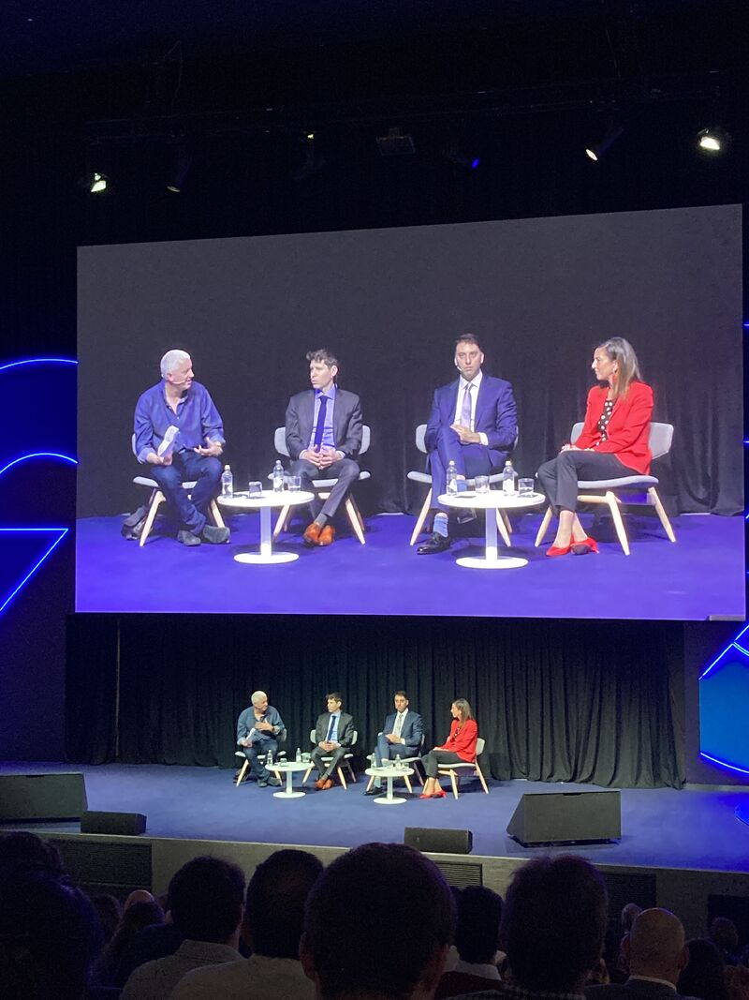
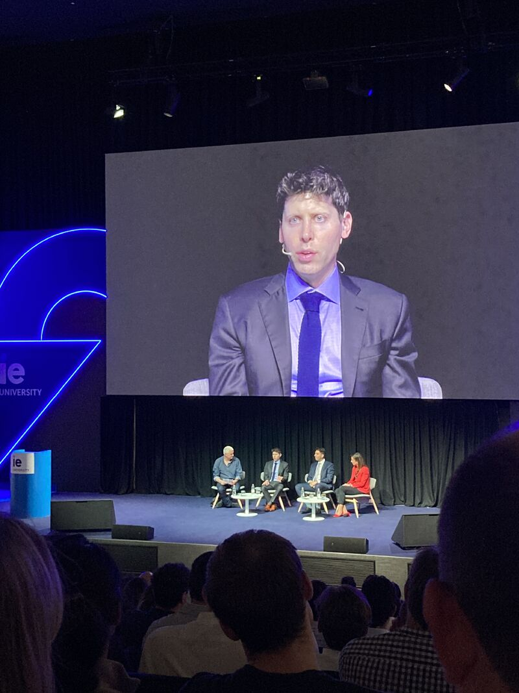
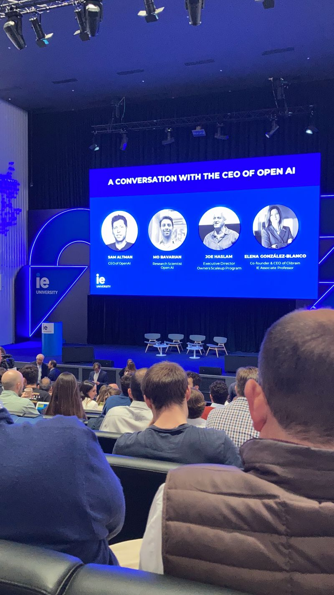

[← Back to CV](../../)

# IE School of Science and Technology

**Master's in Business Analytics and Big Data** at IE. Highlights from the program (datathons, impact project) are summarized on the [home page](../../)—including 1st place at the IE × **NTT DATA** & **o9** Sustainability Datathon and the IE Impact Project (news recommender with **Microsoft**).

## Sam Altman at IE

I attended this as part of the **IE student community** (alongside faculty and guests): *A conversation with the CEO of OpenAI* with **Sam Altman** (**OpenAI**). Photos from the session:

