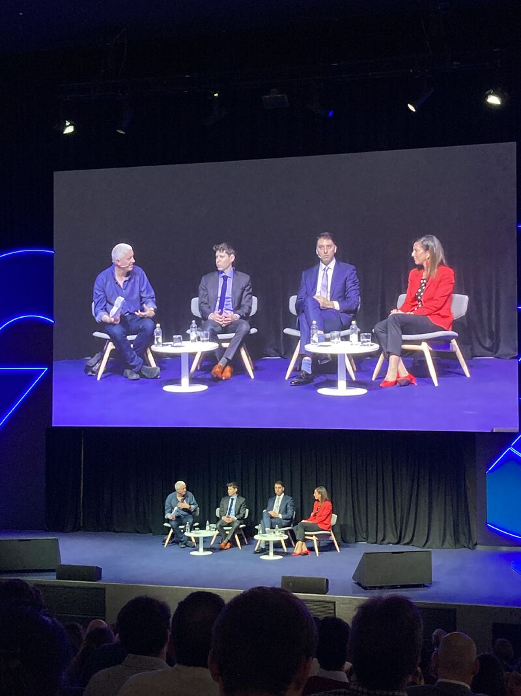
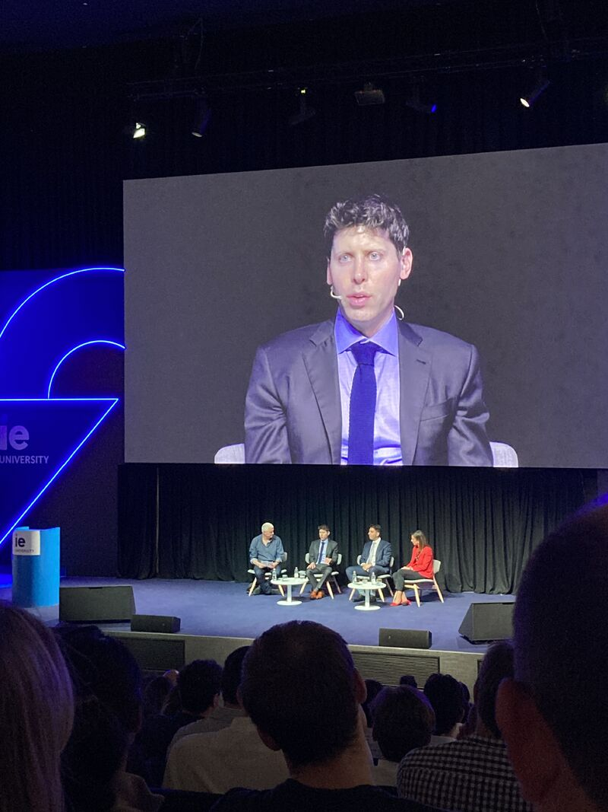
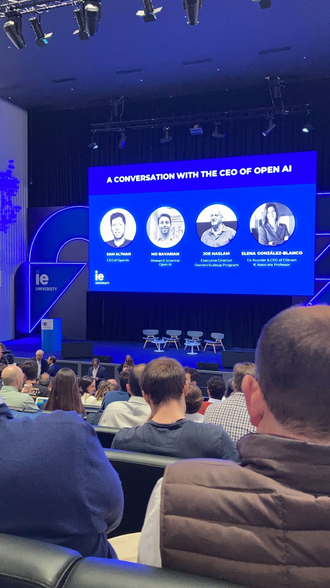

[← Back to CV](../../)

# IE School of Science and Technology

I completed the **Master's in Business Analytics and Big Data** from 2022 to 2023.

The best assignments put a model under a real deadline and made the team explain the decision, not only the score. My teams placed first in the IE, NTT DATA, and o9 Sustainability Datathon and in the IE Impact Project. The Impact Project was a news recommender built with Microsoft.

## FITIZENS internship

I also interned at FITIZENS in Madrid. I worked on human pose estimation with OpenCV and MediaPipe. A webcam frame became body landmarks, OpenCV drew the result, and Streamlit gave the team a browser demo they could test without opening a notebook.

## Sam Altman at IE

I was in the audience for Sam Altman's campus talk, *A conversation with the CEO of OpenAI*. These photos are from the session.

