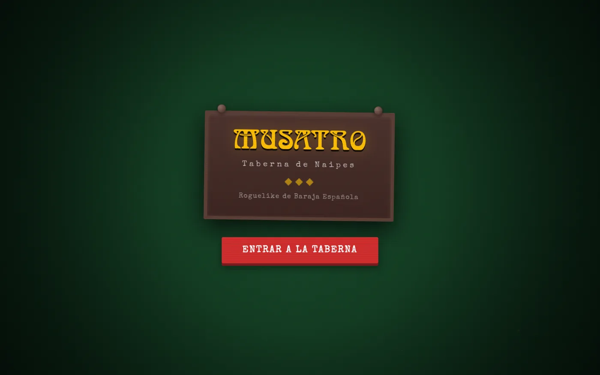
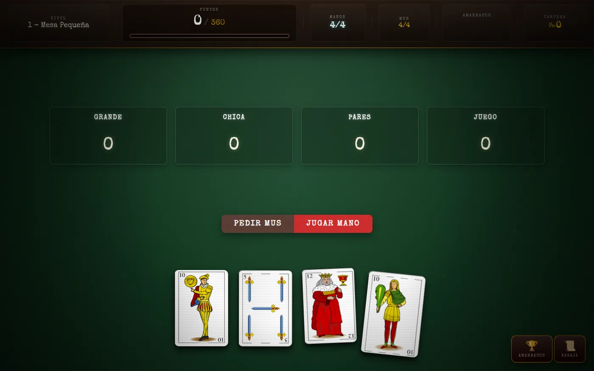
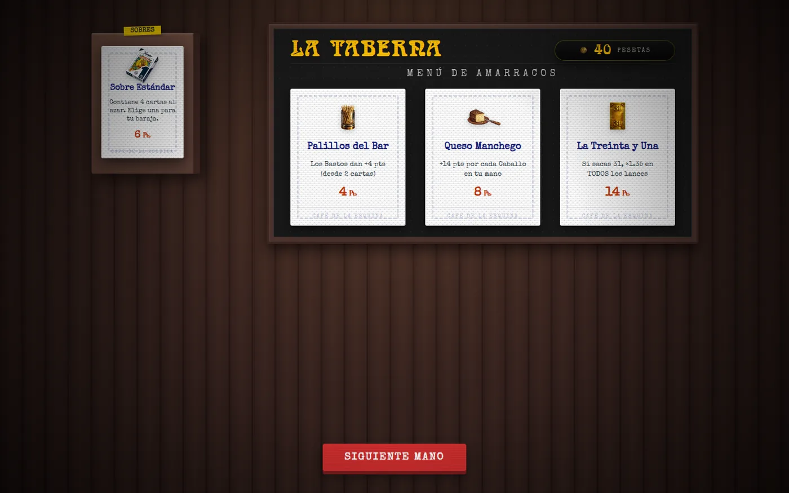
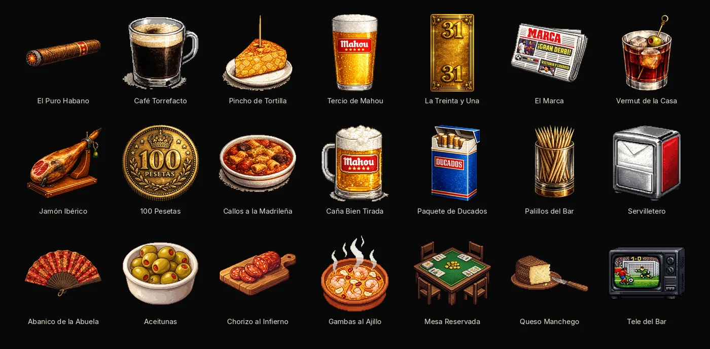

[← Back to CV](../../) · [Projects](../../projects/)

# Musatro

Browser **roguelike deckbuilder** with a **Spanish deck**, built around **Mus**: Grande, Chica, Pares, Juego. The loop is closer to **Balatro** than to a rules-faithful simulator—antes, a tavern, items, and bosses.

A full run is playable in the browser. I stopped mid-build; card editions (`dorada`, `holográfica`) are typed and do not score yet.

## What’s in a run

- Four Mus lances. On each you can pass, envido, envido ×2, or órdago.
- Eight antes: small table, big table, then a boss.
- Tavern between tables: items and packs. You choose the order items apply.
- Twenty-one items and ten bosses. Progress stays in `localStorage`.

3 is King; 2 is Ace. Beat the table score and reach Ante 8.

## How it was built

Strict **TypeScript**, no framework. Run state lives in `Game`; the UI is DOM and CSS. **Vitest** covers the engine—scoring, envite, item order—not the pixels.

Per lance the order is: base → items (your order) → envite → boss. Color and mus apply to the hand total after the four lances.

Hosted on **Cloudflare Pages** at [musatro.felipebasurto.com](https://musatro.felipebasurto.com/). **MIT**.

Tavern names (Mahou, Ducados, and the rest) are bar-culture references, not sponsorships.

## Screenshots

From the [GitHub repo](https://github.com/felipebasurto/musatro): title screen, a hand in play, the tavern, and the 21 items.

## Links

- **Play:** [musatro.felipebasurto.com](https://musatro.felipebasurto.com/)
- **GitHub:** [felipebasurto/musatro](https://github.com/felipebasurto/musatro)
- **Summary on the home page:** [CV / home](../../)
