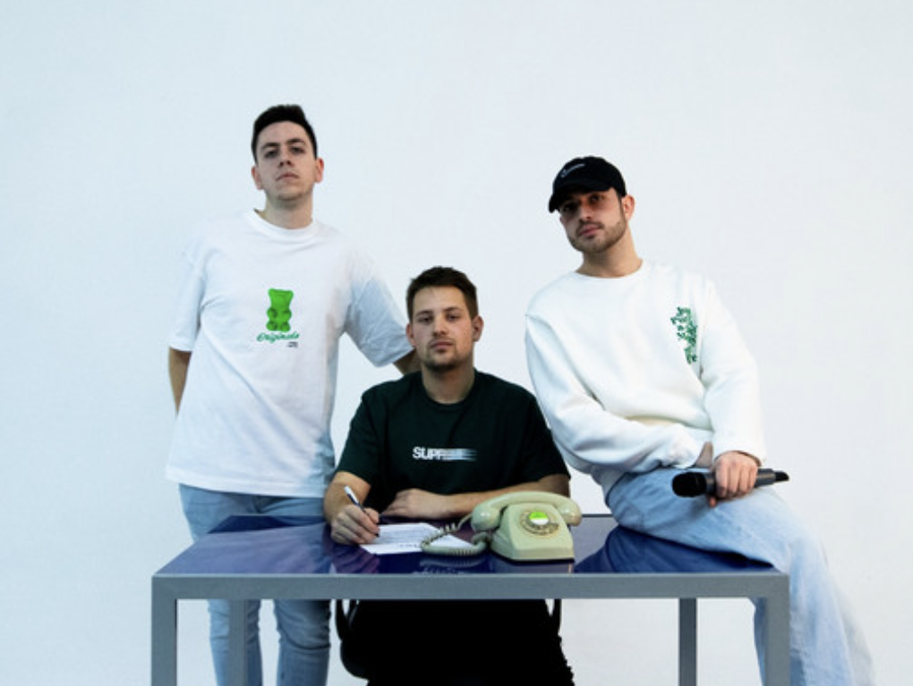

[← Back to CV](../)

# Projects

Side work: **music**, **hobby iOS** apps, and **GitHub**. Professional experience is under [Experience](../).

## Music (Triple Check)

- **[Triple Check](https://open.spotify.com/artist/2uGutUfLOfafsa8NLUjdzR)** — **Spanish pop rock** in **Burgos** with **Miguel Ferrer** and **Diego Garrido**; we met at school, home recordings from **2020**. **1.7M+** all-time streams on Spotify. EP *Atentamente, Triple Check* (2023). **Gigs around Spain.** [Spotify](https://open.spotify.com/artist/2uGutUfLOfafsa8NLUjdzR) · [Details](../triplecheck/)

## iOS (hobby — AI experiments)

- **[Encore: Concert Diary](https://encorearchives.com)** — Concert diary: feed, stats, friends, passport, upcoming, wrapped. **$2k+** on the App Store; short-form video for discovery. [App Store (US)](https://apps.apple.com/us/app/encore-concert-diary/id6748657647) · [Site (ES)](https://encorearchives.com/es) · [Details](../experience/encore/)
- **[HabitDex](https://apps.apple.com/us/app/habitdex/id6755887620)** — Habit + creatures loop; on-device + optional iCloud. **Miguel Ferrer** ([LinkedIn](https://www.linkedin.com/in/mffdr/?locale=en)) on design. [App Store](https://apps.apple.com/us/app/habitdex/id6755887620) · [Product site](https://v0-habitdex.vercel.app/) · [Details](../experience/habitdex/)

## Repositories & coursework

Smaller or teaching-oriented work on GitHub:

- [TfL Data Pipeline](https://github.com/felipebasurto/data-pipeline-tfl-api)
- [Titanic Dataset Analysis](https://github.com/felipebasurto/titanic-dataset-analysis)
- [Perceptron with SVMs](https://github.com/felipebasurto/perceptron-with-svms)
- [Employee Attrition Predictor](https://github.com/felipebasurto/employee-attrition-predictor)
- [Machine Learning in FIFA Ultimate Team 22](https://github.com/felipebasurto/Machine-Learning-in-FIFA-Ultimate-Team-22)
- [Rental Bikes — ML Dashboard](https://github.com/felipebasurto/rental-bikes-interactive-machine-learning-dashboard)
- [Tokyo 2021 Exploratory Data Analysis](https://github.com/felipebasurto/tokio2021-exploratory-data-analysis)
- [Uber Interactive Data Dashboard](https://github.com/felipebasurto/uber-interactive-data-dashboard)
- [Video and Image Processing with MATLAB](https://github.com/felipebasurto/video-and-image-processing-with-MATLAB)
- [Image Processing with scikit-image](https://github.com/felipebasurto/image-processing-with-scikit-image)
