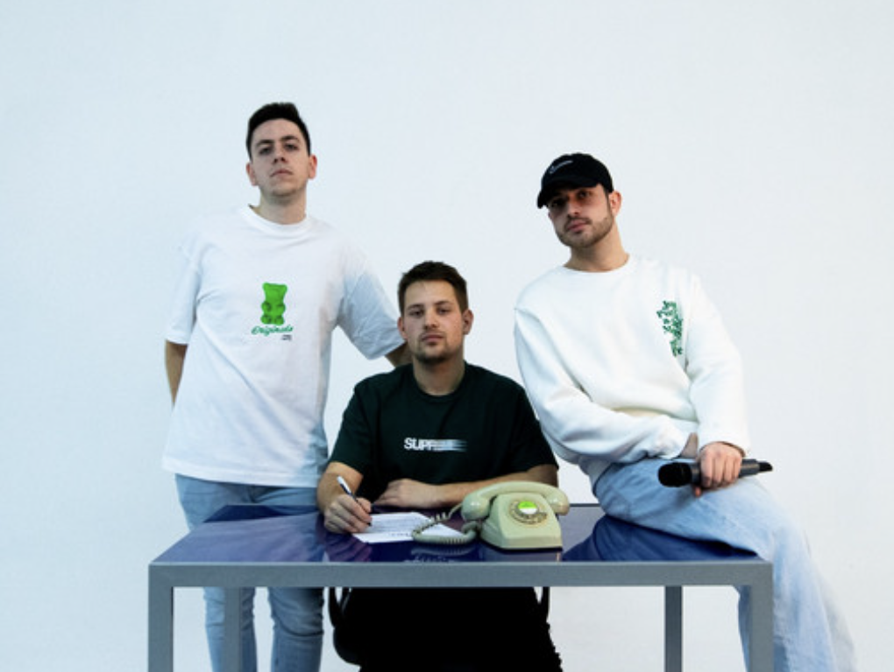
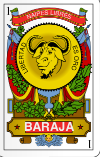

[← Back to CV](../)

# Projects

Side work: **music**, **iOS and Mac** apps, a browser game, and **GitHub**. For Multiverse and AILY, see the [CV](../).

## Music (Triple Check)

- **[Triple Check](https://open.spotify.com/artist/2uGutUfLOfafsa8NLUjdzR)** — Pop-rock from Burgos; three friends, home recordings since 2020. Full story, venues, and live photos on the band page. [Spotify](https://open.spotify.com/artist/2uGutUfLOfafsa8NLUjdzR) · [Details](../triplecheck/)

## Apps (side projects)

- **[Musatro](https://musatro.felipebasurto.com/)**: Roguelike deckbuilder with a Spanish deck, inspired by Mus. Play in the browser. [Play](https://musatro.felipebasurto.com/) · [GitHub](https://github.com/felipebasurto/musatro)
- **[Encore: Concert Diary](https://encorearchives.com)**: Concert diary in Swift/SwiftUI. Features, revenue, and distribution: [Details](../experience/encore/)
- **[HabitDex](https://apps.apple.com/us/app/habitdex/id6755887620)**: Pokémon-style habit tracker; on-device + optional iCloud. **Miguel Ferrer** ([LinkedIn](https://www.linkedin.com/in/mffdr/?locale=en)) on design. [App Store](https://apps.apple.com/us/app/habitdex/id6755887620) · [Product site](https://v0-habitdex.vercel.app/) · [Details](../experience/habitdex/)
- **[Audio Silence Remover](https://apps.apple.com/us/app/audio-silence-remover/id6763403196?mt=12)**: macOS app for short-form voiceovers (TikTok/YouTube): threshold-based silence trim, no ML; open source on GitHub. [App Store](https://apps.apple.com/us/app/audio-silence-remover/id6763403196?mt=12) · [GitHub](https://github.com/felipebasurto/silence-remover) · [Details](../experience/audio-silence-remover/)

## Repositories & coursework

University and weekend repos on GitHub:

- [TfL Data Pipeline](https://github.com/felipebasurto/data-pipeline-tfl-api)
- [Titanic Dataset Analysis](https://github.com/felipebasurto/titanic-dataset-analysis)
- [Perceptron with SVMs](https://github.com/felipebasurto/perceptron-with-svms)
- [Employee Attrition Predictor](https://github.com/felipebasurto/employee-attrition-predictor)
- [Machine Learning in FIFA Ultimate Team 22](https://github.com/felipebasurto/Machine-Learning-in-FIFA-Ultimate-Team-22)
- [Rental Bikes — ML Dashboard](https://github.com/felipebasurto/rental-bikes-interactive-machine-learning-dashboard)
- [Tokyo 2021 Exploratory Data Analysis](https://github.com/felipebasurto/tokio2021-exploratory-data-analysis)
- [Uber Interactive Data Dashboard](https://github.com/felipebasurto/uber-interactive-data-dashboard)
- [Video and Image Processing with MATLAB](https://github.com/felipebasurto/video-and-image-processing-with-MATLAB)
- [Image Processing with scikit-image](https://github.com/felipebasurto/image-processing-with-scikit-image)
