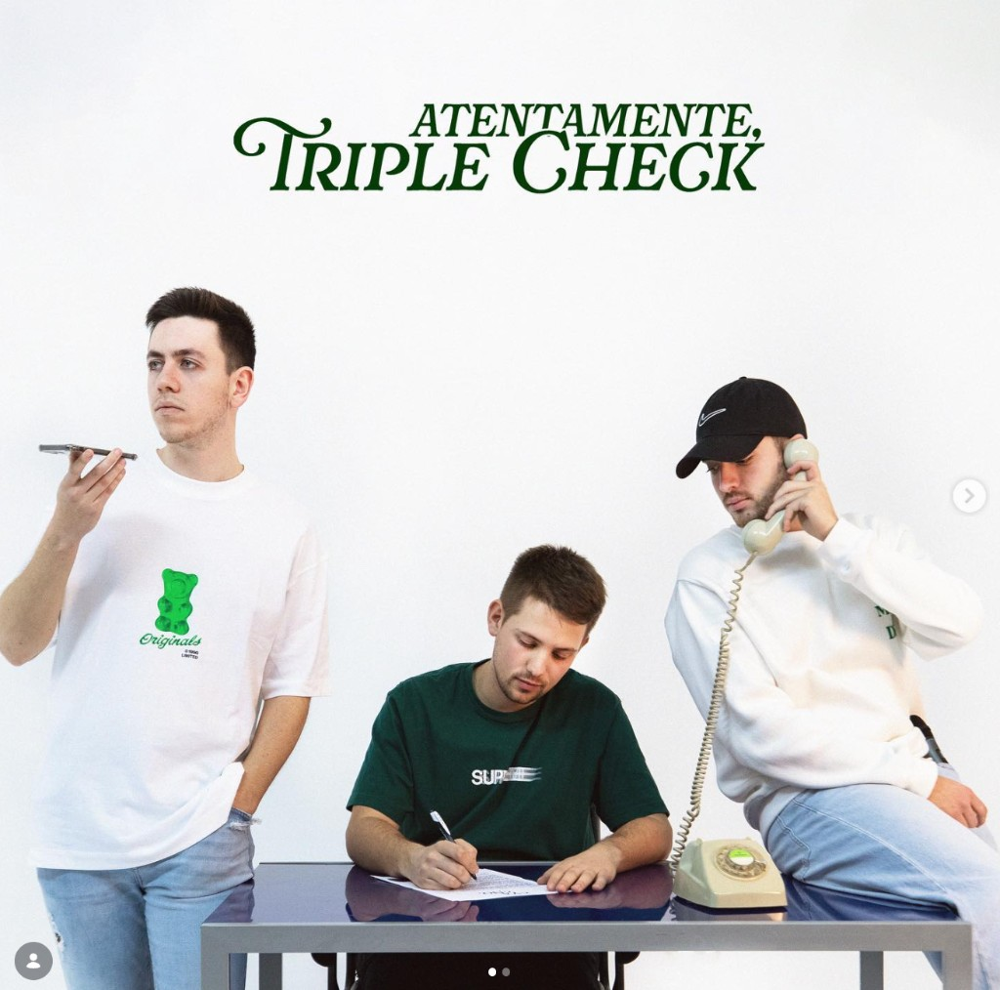
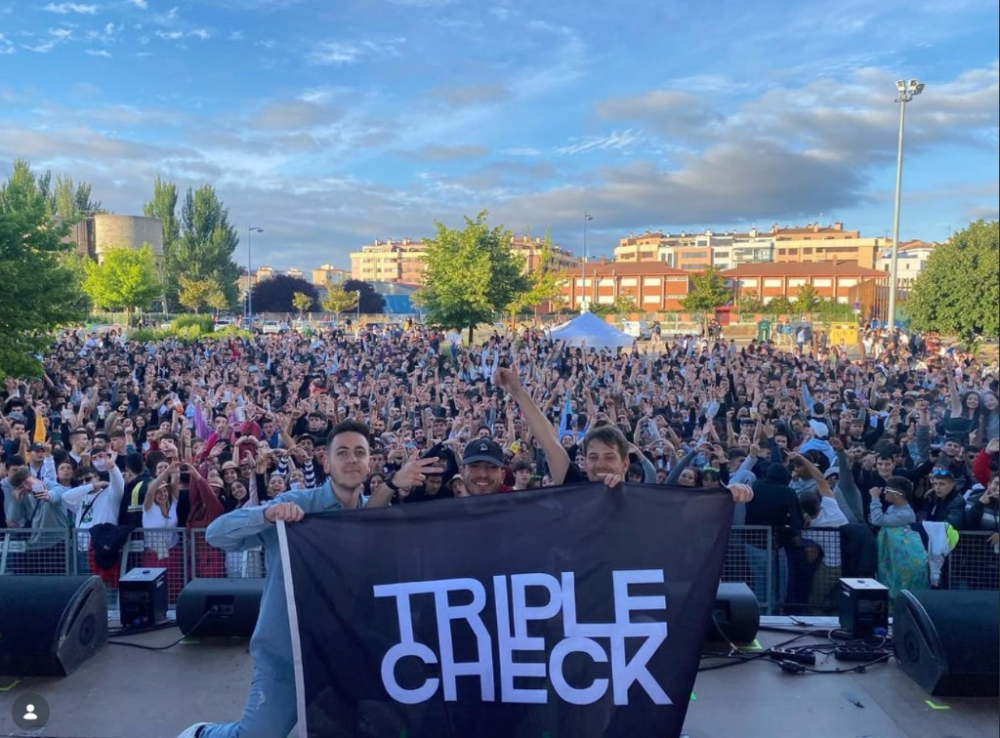
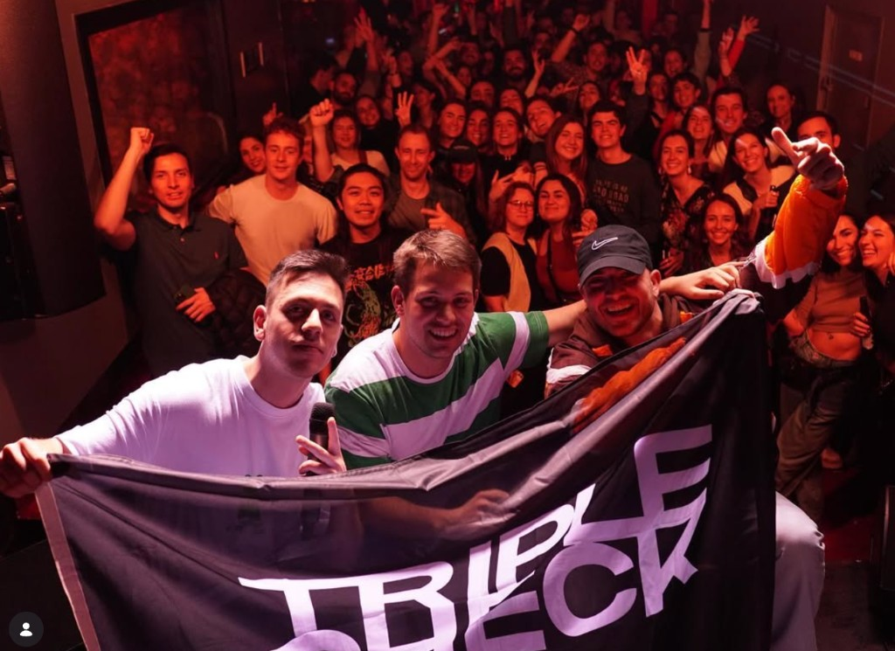

[← Back to CV](../) · [Projects](../projects/)

# Triple Check

**Triple Check** is **Felipe Basurto**, **Miguel Ferrer**, and **Diego Garrido** from **Burgos**. The three of us met at **school** (Jesuitas) and, from **May 2020** onward, started writing and recording at home, releasing songs on streaming platforms from there.

None of us came in with a **musical education** or a roadmap—we had to **learn it all from zero**: writing, production, how a song even gets **finished** and out the door. There was also **no budget**—**not a single euro** of “project money.” We put the whole thing together with what we could scrape together (a mic, an interface, time in a room) and a lot of trial and error, which is how the first batch of material became our debut EP, ***Sabemos*** (five tracks), before a longer run of **singles** and later the ***Atentamente, Triple Check*** **EP (2023)**.

In the band I focus on **production**, **mixing**, and **lyrics**; **Miguel Ferrer** sings and produces; **Diego Garrido** sings. We tend to write from **improvisation** at the mic and then shape the track, rather than always starting from a finished page of lyrics.

## The music

**Spanish pop-rock** with a **contemporary, urban-leaning** production polish—closer in spirit to radio-oriented acts such as [El Canto del Loco](https://es.wikipedia.org/wiki/El_Canto_del_Loco), [Pignoise](https://es.wikipedia.org/wiki/Pignoise), or [Despistaos](https://es.wikipedia.org/wiki/Despistaos) than to a straight rap act, but with the kinds of hooks and sonics that fit Spanish playlists in the **early 2020s**. Lyrics cover the usual ground for our 20s: going out, relationships, nostalgia, looking ahead—without forcing a single fixed persona.

**Collaborations** and one-off production passes matter too—e.g. the single ***Checkout*** (on [**Spotify**](https://open.spotify.com/artist/2uGutUfLOfafsa8NLUjdzR) with the rest of the catalog) featuring [**Safree**](https://music.apple.com/es/artist/safree/599718024), with production by [**Johnatan Pons**](https://www.instagram.com/soyjonathanpons/) — a clear step up in how the record sounded. [**Spotify**](https://open.spotify.com/artist/2uGutUfLOfafsa8NLUjdzR) has the full, current catalog; ***Atentamente, Triple Check*** (2023) is the release that best represents us.

## Listings, venues, and ticket hubs

A few **public links** (venues, old bills, ticket hubs) — not a full history:

- **Burgos (bar Carabás):** [entradas / concierto (Tomaticket)](https://www.tomaticket.es/es-es/entradas-concierto-de-triple-check-en-en-burgos) · [ficha del local](https://www.tomaticket.es/es-es/recintos/carabas-burgos) · [video (YouTube)](https://www.youtube.com/watch?v=GoWbek9VRvw)
- **Madrid — Sala Vesta:** [Sala Vesta — evento](https://salavesta.com/events/triple-check/) · [Madrid en Vivo](https://madridenvivo.com/evento/triple-check/) · [Sala Vesta (web)](https://salavesta.com/) (C/ Barquillo, 29) · [video (YouTube)](https://www.youtube.com/watch?v=rWcaNqSyou4)
- **Barcelona — Sidecar:** [sidecar.es](https://www.sidecar.es/) (Plaça Reial, 7)
- **Valladolid — Porta Caeli (with Iskender):** [Sala Porta Caeli](https://salaportacaeli.com/) — shared bill with [**Iskender**](https://open.spotify.com/artist/5UjU9W0brAL4BEwyiGBy8r) (Valladolid; spelling also **Iskander** on some socials)
- **Madrid (bill with SANTAS, 2023):** [Café la Palma — **TRIPLE CHECK + SANTAS** (programme / “cartel” page)](https://www.cafelapalma.com/programacion/triple-check-santas/) · [Café la Palma on **Tomaticket**](https://www.tomaticket.es/recintos/cafe-la-palma-madrid)

## Spotify (by the numbers)

**All-time streams** on Spotify, per the artist catalog in the app, are past **1.7M** plays, with several tracks in the **six figures**. We’re an independent three-person operation—the numbers reflect people keeping the songs in rotation.

## Live

We’ve played **gigs around Spain**—smaller rooms, a few outdoor stages, shared bills. The photos are from that side of things. An early one was in **Burgos** at [bar **Carabás** (Tomaticket)](https://www.tomaticket.es/es-es/entradas-concierto-de-triple-check-en-en-burgos) — [video (YouTube)](https://www.youtube.com/watch?v=GoWbek9VRvw). We’ve also played [**Sala Vesta**](https://salavesta.com/events/triple-check/) in **Madrid** ([video](https://www.youtube.com/watch?v=rWcaNqSyou4)), at [**Sidecar**](https://www.sidecar.es/) in **Barcelona** (Plaça Reial), and at [**Sala Porta Caeli**](https://salaportacaeli.com/) in **Valladolid** on a night with [**Iskender**](https://open.spotify.com/artist/5UjU9W0brAL4BEwyiGBy8r). Later, a **Madrid** date with [**SANTAS**](https://acqustic.com/santas/) at [Café la Palma](https://www.cafelapalma.com/programacion/triple-check-santas/) (Feb 2023, [event page](https://www.cafelapalma.com/programacion/triple-check-santas/)). Since then, the setlist and the routing have kept moving.

Booking: the links below, or the email on my [home page](../).

## What it is to me now

**Triple Check** is still a meaningful stretch of my life: whenever someone listens to a track, or goes out of their way to say they like what we made, it lands in a way no stream count can capture. We started from nothing—no training, no money, just the three of us and stubborn curiosity. Grateful that still shows up in people’s headphones.

## Links

- **Spotify (artist):** [Listen on Spotify](https://open.spotify.com/artist/2uGutUfLOfafsa8NLUjdzR)
- **YouTube:** [YouTube channel](__YOUTUBE__)
- **Live — Burgos (Carabás):** [YouTube](https://www.youtube.com/watch?v=GoWbek9VRvw)
- **Live — Madrid (Sala Vesta):** [YouTube](https://www.youtube.com/watch?v=rWcaNqSyou4)
- **Venues & listings:** see [**Listings, venues, and ticket hubs**](#listings-venues-and-ticket-hubs) above
- **More:** [felipebasurto.com](../)
