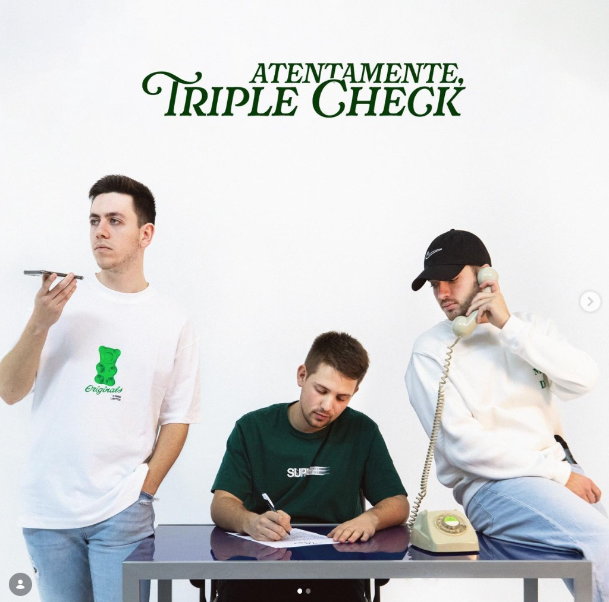
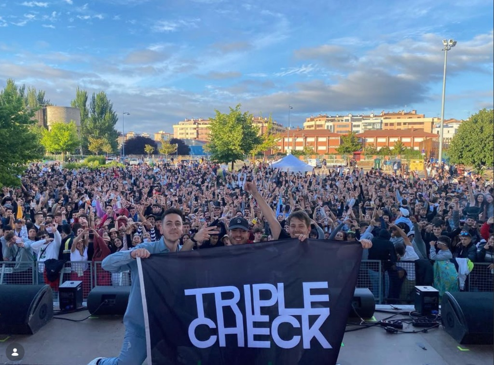
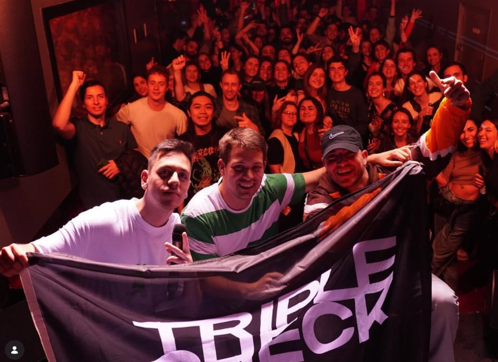

[← Back to CV](../) · [Projects](../projects/)

# Triple Check

Triple Check is Felipe Basurto, Miguel Ferrer, and Diego Garrido. We met at Jesuitas in Burgos and began writing at home in May 2020.

None of us had formal musical training or a band budget. The early setup was a microphone, an interface, and whatever room was free. We learned production by finishing songs and hearing every mistake in the next mix.

I focus on production, mixing, and lyrics. Miguel sings and produces. Diego sings. Most songs start with someone improvising at the microphone, not with a finished page of lyrics.

## The music

We play Spanish pop-rock. [El Canto del Loco](https://es.wikipedia.org/wiki/El_Canto_del_Loco), [Pignoise](https://es.wikipedia.org/wiki/Pignoise), and [Despistaos](https://es.wikipedia.org/wiki/Despistaos) are fair reference points. The songs are about nights out, relationships, and the parts of your twenties that become clearer later.

The debut EP, *Sabemos*, has five tracks. A run of singles followed. *Atentamente, Triple Check* from 2023 is the release that best represents us now.

The single *Checkout* features [Safree](https://music.apple.com/es/artist/safree/599718024) and was produced by [Johnatan Pons](https://www.instagram.com/soyjonathanpons/). Johnatan gave it a sharper finish than we could get in the room by ourselves.

## Reach

The catalog has passed 1.7 million Spotify streams. Several tracks are in six figures. We have no label, so the fact that strangers still save and replay these songs is the number that matters.

## Live

We have played bars, small rooms, outdoor stages, and shared bills around Spain.

- Burgos. [Carabás listing](https://www.tomaticket.es/es-es/entradas-concierto-de-triple-check-en-en-burgos) · [video](https://www.youtube.com/watch?v=GoWbek9VRvw)
- Madrid. [Sala Vesta listing](https://salavesta.com/events/triple-check/) · [video](https://www.youtube.com/watch?v=rWcaNqSyou4) · [Café la Palma with SANTAS](https://www.cafelapalma.com/programacion/triple-check-santas/)
- Barcelona. [Sidecar](https://www.sidecar.es/)
- Valladolid. [Sala Porta Caeli](https://salaportacaeli.com/) with [Iskender](https://open.spotify.com/artist/5UjU9W0brAL4BEwyiGBy8r)

## Why it still matters

A message from someone who found a song still hits harder than the stream count. Three school friends made those songs in spare rooms. They travelled further than we did.

[Listen on Spotify](https://open.spotify.com/artist/2uGutUfLOfafsa8NLUjdzR). For bookings, use the email on my [home page](../).
